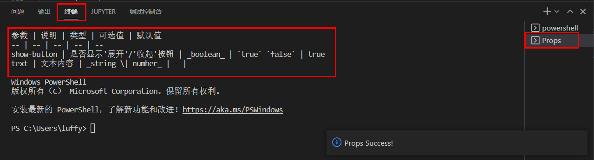

# props-mark

vscode插件，自动生成Markdown格式的Props介绍文档

* 用法介绍

  **在.vue文件中，使用快捷键Shift+Q,会在终端打开一个名为Props的命令行，包含props内容**

  

  * 书写规范

    > 第一行注释：参数说明
    > 
    > 第二行注释：参数可选值（可省略）
    > 
    > validator可省略
    >

    ```javascript
    props:{
      // 是否显示'展开'/'收起'按钮
      // `true` `false`
      showButton: {
        type: Boolean,
        default: true,
        validator(value) {
           return typeof value === 'boolean';
        }
      },
      // 文本内容
      text: {
        type: [String,Number],
        default: ''
      }
    }
    ```
  * 生成示例

    | 参数        | 说明                      | 类型                 | 可选值             | 默认值 |
    | ----------- | ------------------------- | -------------------- | ------------------ | ------ |
    | show-button | 是否显示'展开'/'收起'按钮 | _boolean_          | `true` `false` | true   |
    | text        | 文本内容                  | _string \| number_ | -                  | -      |

  - 功能介绍

    * [X] 驼峰参数名自动转为中划线：`showButton -> show-button`
    * [X] 最终生成的内容自动根据参数首字母排序
    * [X] 支持多个type值的情况： `type:[String,Number]`
